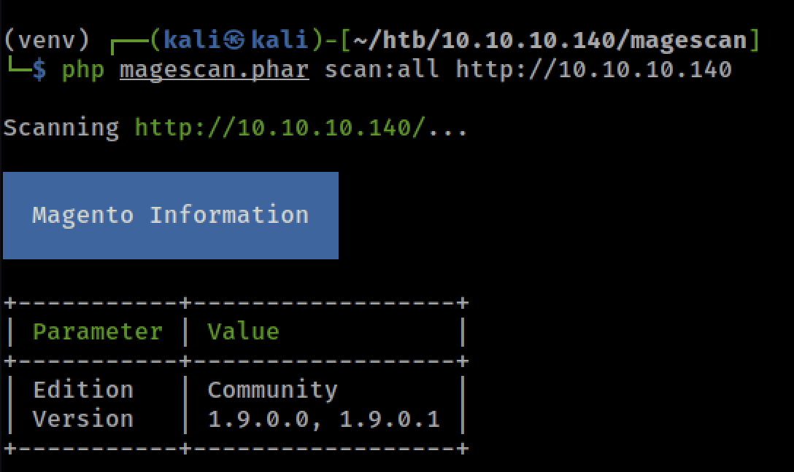
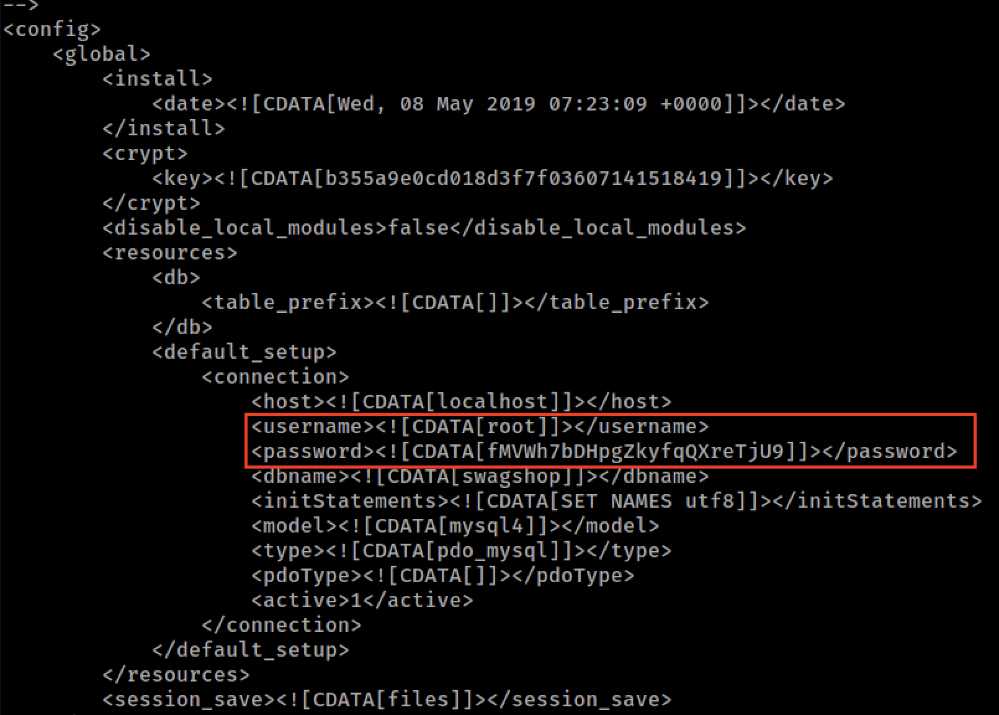
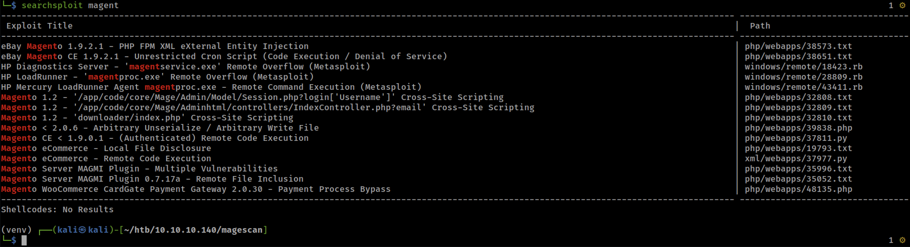
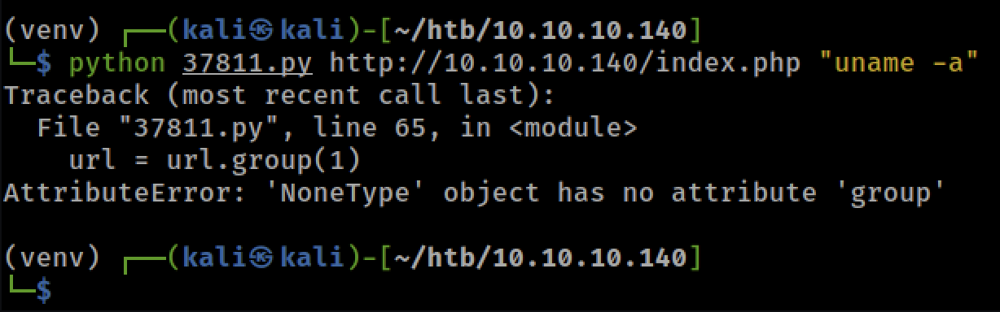
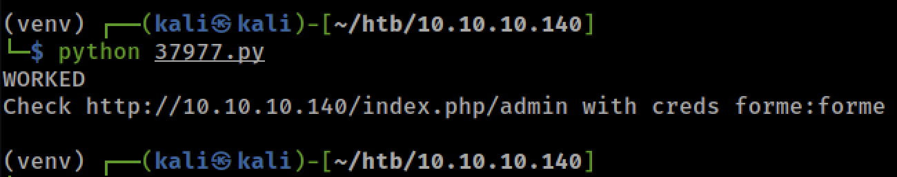
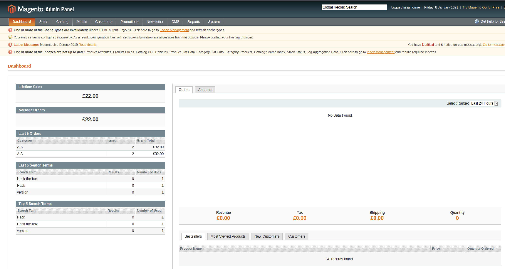

# SwagShop
SwagShop on HTB.

## Enumeration
Enumeration done with `nmapAutomator` to find initial ports, (22,80) the `gobuster` and `nikto` to enumerate the web application. After inspection, it appears to be a magento online store. Looking over some of the files discovered via directory enumeration it looked to be version 1.9. Found the tool [magescan](https://github.com/steverobbins/magescan.git) which was able to enumerate the version to be 1.9. Furthermore, it enumerate the database username and password.

### gobuster

### nikto

### magescan
```bash
wget https://github.com/steverobbins/magescan/releases/download/v1.12.9/magescan.phar

php magescan.phar scan:all http://10.10.10.140
```




###

## Explotation
Searching through `searchsploit`, there are several exploits targeting magento 1.9.

Working through the exploits for the version, one at a time.

### 37811.py
This exploit is authenticated RCE. Tested making a test user on the system and it worked (e.g. did not require email verification) so this exploit might be possible.

First issue with the exploit is running python2 on modern kali. Had to manually install several of the dependencies as seen below.

```bash
# install pip
curl https://bootstrap.pypa.io/get-pip.py --output get-pip.py

python2 get-pip.py

pip instal virtualenv

python2 -m virtualenv venv

source venv/bin/activate

# install the dependencies
pip install mechanize
```

The code requires a username and passsword to be hardcoded into the begining of the script. In testing, it was discovered there was an issue with the submission form related to the password. This was done after the modification for the username at line 53
```python
br.select_form(nr=0)
br.form.new_control('text', 'login[username]', {'value': username})  # Had to manually add username control.
br.form.new_control('text', 'login[password]', {'value': password})  # Had to manually add username control.
br.form.fixup()
```

However, even after the fix, the exploit did not work as expected.



Looking through the code and trying to get it to execute manually, it seems that the exploit logs in with the provided usernames and passwords in the script file then attempts to construct a dynmaic query with command injection present. Reading through the exploit, there is an ajax URL it pulls from the login redirect page. Manually running this through burp and inspecting the redirect source code (as captured in burp) only had one reference to ajax, and it was not the full string referened in the script. This exploit appears to no work for this version.

### 37977.py
This exploit uses an SQL injection to add an administrative user to the system. The script only requires modification to specify the correct host to target. After this was done, it was found to work against the target. The exploit adds the administrative user forme with password forme.


