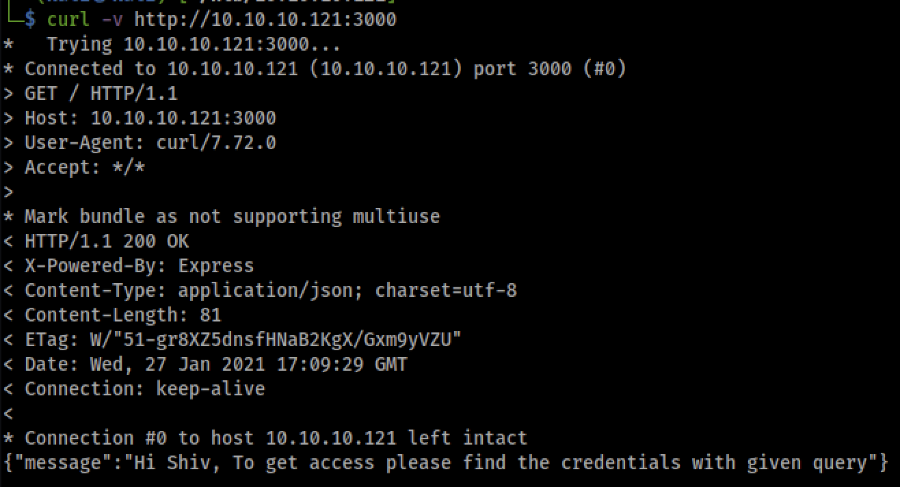

# Help
Help box on HTB.

## Take-Aways
* Read the source code for the version to determine file storage locations on the web server
* Test exploits on a controlled environment (e.g. install the software) to examine the effect
* Don't assume an upload did not occur even if an error is returned
* Check the history, look for common mistakes (maps locks on)

## Enumeration
### NMAP Automator
Use this script to get results fast and get some automation out of the way
```bash
nmapAutomator 10.10.10.121 All
```

The results indicate there here are the following ports open.
* 22 / SSH
* 80 / HTTP
* 3000 Node JS

### Gobuster
```bash
# dig on the http server
gobuster dir -w /usr/share/wordlists/dirbuster/directory-list-lowercase-2.3-medium.txt -u http://10.10.10.121:80/ -s '200,204,301,302,307,403,500' -e | tee "80_gobuster_common.txt"

/index.html (Status: 200)
/support (Status: 301)
/javascript (Status: 301
```

The results of the these scans and manual poking reveal a base install `index.html` installed in the web root and that `/support` yeilds what appears to be a helpdesk site.


```bash
# dig on the nodejs server
gobuster dir -w /usr/share/wordlists/dirbuster/directory-list-lowercase-2.3-medium.txt -u http://10.10.10.121:3000/ -s '200,204,301,302,307,403,500' -e | tee "3000_gobuster_common.txt"
```

Gobuster did not find any helpful endpoints for this server, but curling the web root reveals a json endpoint which talks of a credential.



### Nikto
```bash
nikto -h http://10.10.10.121:80

nikto -h http://10.10.10.121:3000
```

Nikto doesn't reveal any additional data that `nmap` did not.

### HelpdeskZ
Starting with HelpdeskZ because it seems less like a custom application and more likely to have published vulnerabilities. After poking around the website, it looks like we can enter a ticket with an attachment. It appears default username and password are assigned during installation and there are no default ones. Additionally, it does not support open user registration. So, at this point, there is no access to the system, but have the ability to enter a ticket. Looking through `searchsploit`, there are two vulnerabilities which target the software.


Based on the known characteristics, the one chance is is arbitrary file upload.

#### 40300.py
Reading through the exploit, it appears that we are able to upload a PHP webshell as part of the ticket however, it is somewhat mitigated by the fact that web shell is uploaded to an upload directory with a seemingly random file name. However, as the exploit determined, the file name is generated based on time and an md5 hash which makes the resultant file name brute forcable provided a known upload location. Some issues in attempting this exploit.

PHP file extension is blocked.


The actual upload location is not known. Re `gobuster`ing on the `/support` endpoint to search finds the an upload directory, however this redirects to `/` which is the apache default `index.html`. Looking at the repository in github, it appears to have the installation structure in the directory. Inspecting the [uploads](https://github.com/evolutionscript/HelpDeskZ-1.0/tree/master/uploads) folder it has an `index.php` which redirects to the webroot which is the behavior observed. There is a tickets directory in this folder as well, which has the same results (redirection). Testing this on the live server, it too redirects to the webroot. It seems possible that this is the location that the attachements night be uploaded to. To get around the upload error, a test file, with the png file extension was uploaded. Executing the exploit script against this upload location was able to discover this script. All testing was run through Burp proxy to get a log of the web requests for recall later. The expoit was modified to search for the png file extension, rather than the php file extension as validation.

```bash
export HTTP_PROXY=127.0.0.1:8080

python 40300.py http://10.10.10.121/suport/uploads/tickets/ frog_PNG35747.png
```


Now, to get code execution on the uploaded file. At a first attempt, trying to use null byte injection to trick the upload php code into accepting a PHP file and uploading to upload location. In testing, this was found to not work. After uploading and injecting upon the request, there was no upload php file.


After additional testing, no obvious way was determined to bypass this restriction. However, after some investigation online, reading source code, and testing locally in a docker container, it was observed that even though the client side application indicates the file was rejected because of the file type, it is still sent to the server and the server will still place it in the uploads directory. The client side error message did not affect actual upload process. Thus, the webshell can be uploaded and executed on.


## Root Shell
With the low privilege shell, doing some of basic enumeration revealed the method for prvilege escalation.

```bash
#
# Always upgrade the shell to a tty with python first, or get a new reverse shell without going through PHP
#

# see user
whoami

# see any sudo access availble
sudo -l

# check other ports listening
netstat -tupan

# see running process
ps -ef --forest

# checkout home dir, read history files and look for sshes
cd ~
ls -altr
cat .bash_history
ls -altr .ssh

# see other users, and paswords
cat /etc/passwd
cat /etc/shadow
cat /etc/groups
cat /etc/sudoers
```

After those basic enumerations, is generally time to move onto some more automated scripts, specifically `LinEnum.sh` however those basic steps, specifically running history yeilded some results.


Specifically, entry 9, looks interesting in that it could be a password for `su`. Attempting that did not work, however, inspecting it, it is in reverse camel case, which seems like it may have been entered with the caps-locks on. Using the inverted form the the password, it is found to give access to root.

