# DC2
## Overview
This is a writeup of the vulnhub machine [DC2](https://www.vulnhub.com/entry/dc-2,311/)
## Key Takeaways
1. Use `cewl` to augment wordlists in brute forcing
2. Vim Shell Breakout
## Enumeration
The open ports were discovered to be 80 (HTTP) and 7744 (SSH) with nmap and [nmapAutomator](https://github.com/ryohare/nmapAutomator).
```bash
# nmap
nmap -n -p- -sTCV -T4 -Pn --script=vuln --script-args="unsafe=1" 192.168.1.18

# or nmapAutomator
nmapAutomator 192.168.1.18 All
```
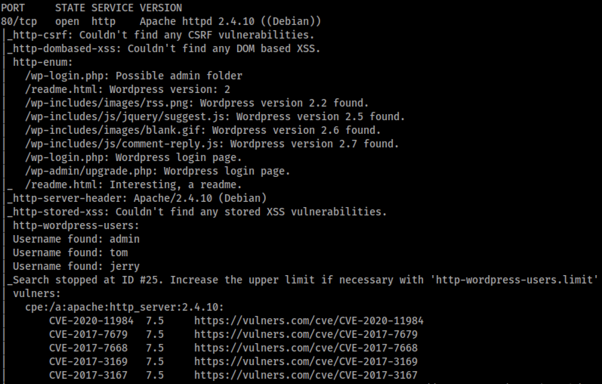
Directly from nmap output, we see that the site is a wordpress sight. This means we should scan with `wpscan` to determine wordpress versions and plugins on the site which we can cross reference for vulnerabilities.
```bash
wpscan --url http://192.168.1.18 --enumerate ap,at -t 16
```
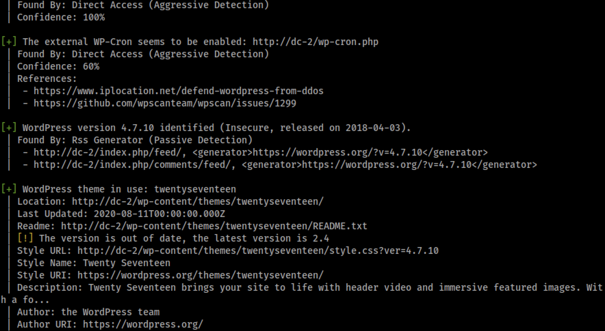
From this information, we are able to see the plugins, none of which seem vulnerable as well as the version. In addition, previously, we had pulled usernames from the nmap script. Taking a look at the WP site, we find a hint flag. This flag indicates that we should brute force the discovered users, `tom` and `jerry` and `admin` using WP scan with a word list generated from the website's content via `cewl`

```bash
# wordlist via cewl
cewl http://192.168.1.18/ -d 4 -w cewl.txt

# brute force each user
wpscan --url http://192.168.1.18 -P cewl.txt -U tom
wpscan --url http://192.168.1.18 -P cewl.txt -U jerry
wpscan --url http://192.168.1.18 -P cewl.txt -U admin
```
Running the brute force scripts, Tom and Jerry's passwords were discovered as can be seen in the screenshots below.

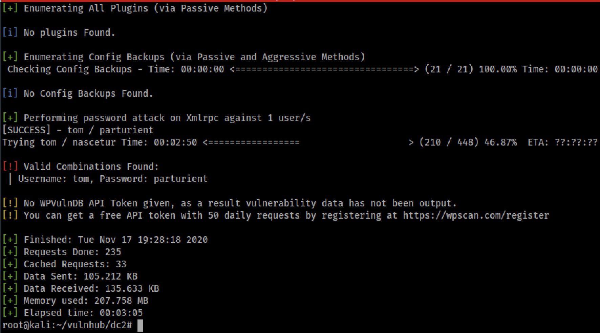
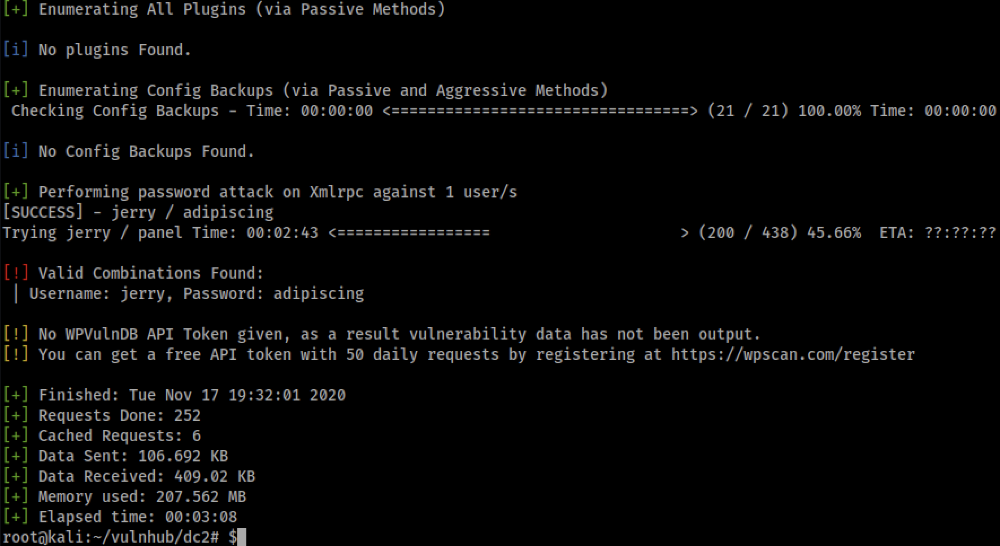

A this point, we have credentials for two users to the WP site. Just to try something, we tried the users as SSH users to the SSH server on the non-standard port 7744. Tom's credentials were found to work.

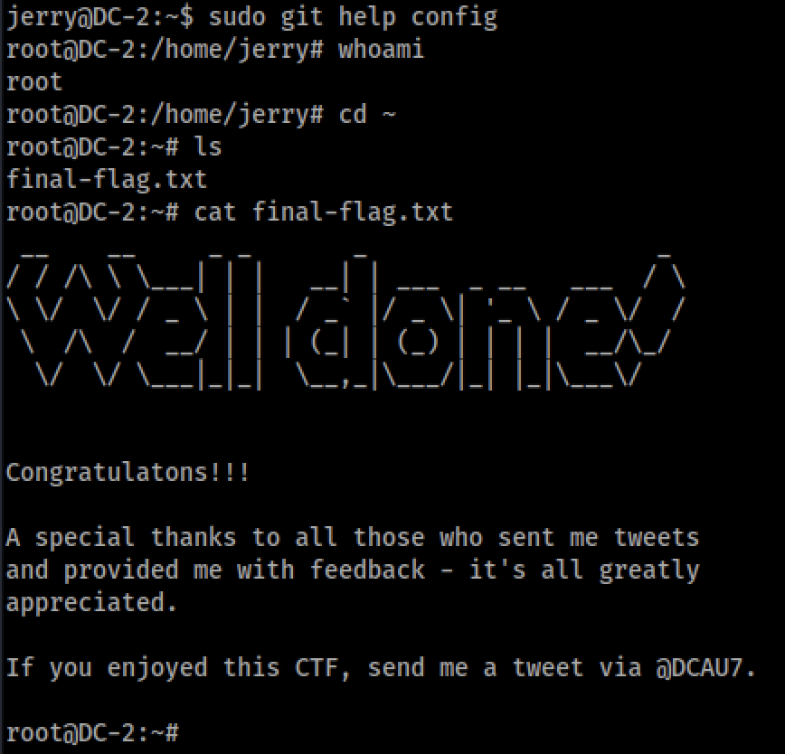

During basic enumeration of the system, we find that Tom has a `rbash` login shell which severly limits what actions we can perform. All tools are restricted to /home/tom/usr/bin which, after breaking out, only had a few binaries in it. In order to make any progress, it is necessary to break out of the restricted shell into a full bash shell. Working through known break out techniques (google search to find them), vi was a binary which was accessiable and enabled a way to invoke a shell through the text editor giving us an unrestritected shell. The `PATH` variable was still garbage after breakout, so it was populated with the standard linux paths.

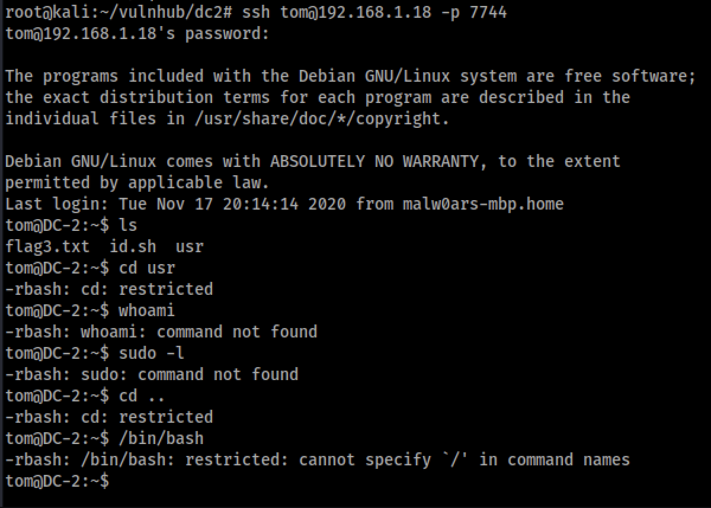
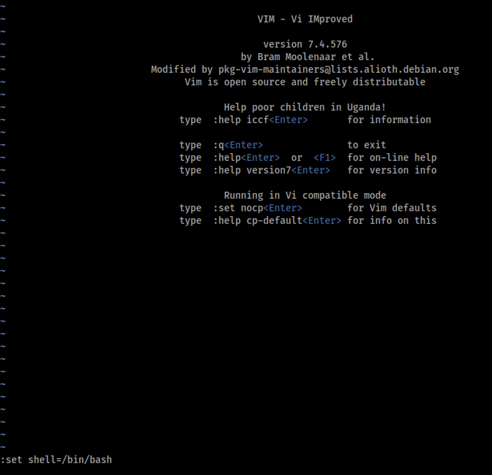
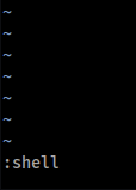
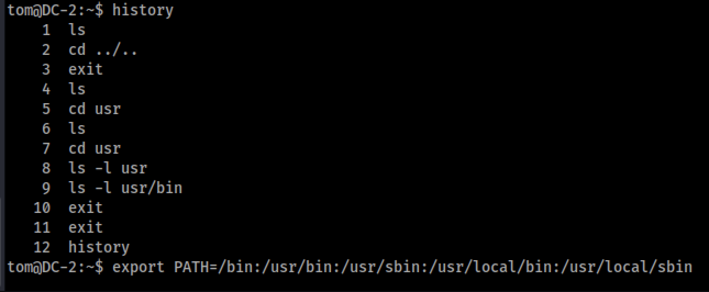

Reading the flag3 in Tom's home directory gives the hint that we should look to `su` to Jerry now that we have a normal shell. Given that we have a potential credential for Jerry from WP, we can just try `su jerry` which we find to work. Then enumerate home directory of Jerry. After catting out .bash_history, it appears Jerry has some sudo permissions, which are enumerated via `sudo -l` and it's found that Jerry can run git as root.

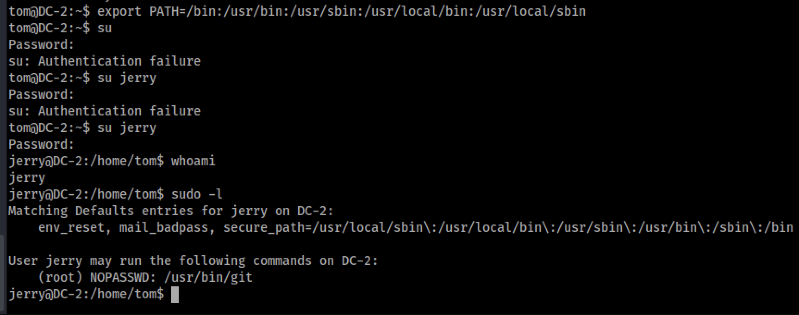

Looking at [GTFOBins](https://gtfobins.github.io/gtfobins/git/), there is a shell breakout of git which means we can run git via `sudo` and get a shell then as root.

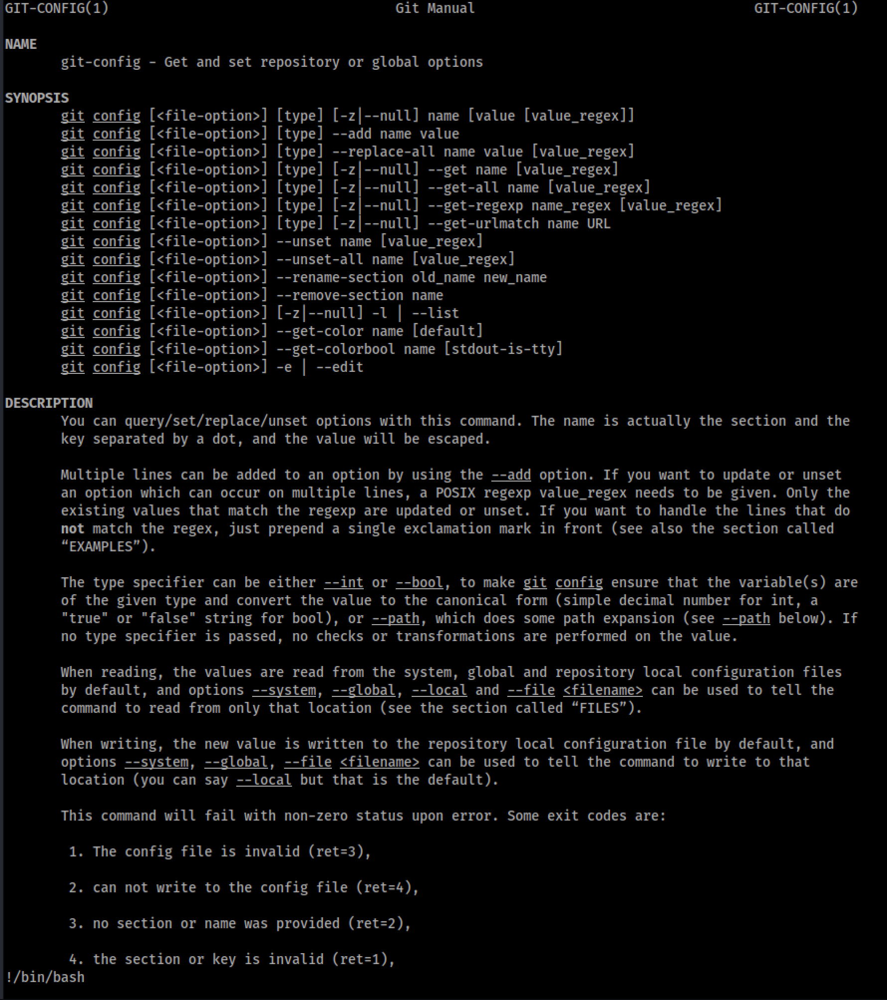

And now we have a root shell.