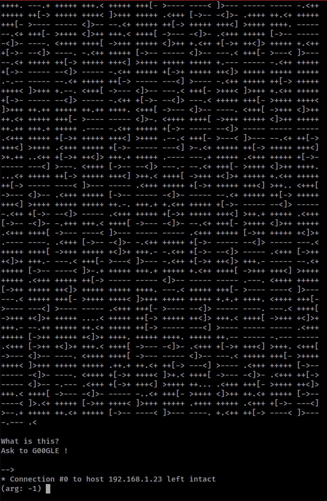
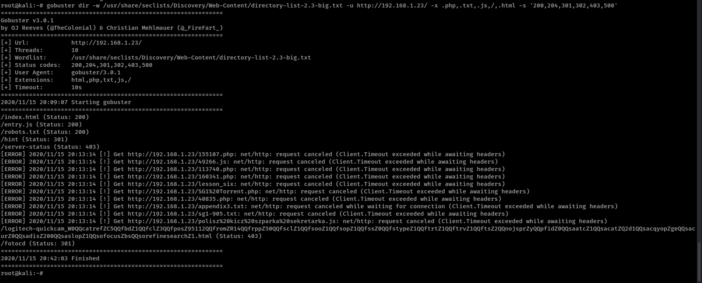

# Tenderfoot
## Overview
This is a writeup of the vulnhub machine [tenderfoot](https://www.vulnhub.com/entry/tenderfoot-1,581/)
## Key Takeaways
1. If it looks like base64 encoded, right might be base32 encoded instead
2. When in a home directory, always enum with `find .`
3. Always review the setuid programs
4. Always check `sudo -l` for compromised accounts
## Enumeration
### Find the Machine
Find the machine's IP with a fast nmap scan
```bash
nmap -T4 -Pn -n -sTC -F 192.168.1.0/24 --open
```

### Enumerate Machine Fully
Two methods to do withs, either manually with nmap or with an automator such as [nmapAutomator](https://github.com/ryohare/nmapAutomator). NmapAutomator will run additional scripts based on the findings as well such as gobuster.
#### Manual NMAP
```bash
nmap -n -p- -sTCV -T4 -Pn 192.168.1.23
```

#### NmapAutomator
```
nmapAutomator 192.168.1.23 All
```

After scanning either way, it appears only SSH and HTTP are open. SSH is usually never the avenue, so time to start enumerating the webserver with Nikto and Gobuster.
### Enumerating HTTP (80)
#### Nikto
```bash
nikto -h 192.168.1.23
```

Nikto reveals the webserver is a bit dated, `apache 2.4.28`. A vuln scan can be run via nmap to see if there is anything which we could do to exploit the webserver.
```bash
nmap -n -p80 -T4 -sCTV --script=vuln --script-args="unsafe=1" 192.168.1.23
```

The Vuln script reveals that there are multiple vulns affecting this version of apache, with exploit code. After reviewing, one is determined to be a local privesc, which could be helpful further down the road. The others are DoS vulns so they dont seem that helpful there. Probably time to move onto web directory enumeration.
#### Robots.txt
Before gobuster, always check for a robots.txt
```bash
curl -v http://192.168.1.23/robots.txt
```

This seems to indicate that there is a hints directory, going down this rabit holes...
```bash
curl -v http://192.168.1.23/hint -L
```

Looks like base64 and attempted to decode, however it failed. Turns out, (needed to google thig) its base32 encoded. So, *if it looks base 64 but gives out garabage, maybe its base32*.
```bash
echo -n "EBPV6X27L5PV6X27L5PV6X27L5PV6X27L4FHYICOGB2GQ2LOM4QEQZLSMUQSAIBAEAQCA7AKPQQFI4TZEBZW63LFORUGS3THEBSWY43FEF6AUIBNFUWS2LJNFUWS2LJNFUWS2LJNFUWS2LIKIVXHK3LFOJQXIZJANVXXEZJAHIUQ====" | base64 -d
```

Well, it seems like this was a dead end, on to full web directory enumeration with gobuster.
### Gobuster
Note, the default gobuster in nmapAutomator uses the dirbuster 2.3 medium wordlist. During this enumeration, we didn't turn up any useful directories, so we moved to the large list to see if we just missed the directory.
```bash
gobuster dir -w /usr/share/seclists/Discovery/Web-Content/directory-list-2.3-big.txt -u http://192.168.1.23/ -s '200,204,301,302,307,403,500' -e | tee "80_gobuster_common.txt"
```

Running with the wordlist from seclists (which I should use as the source for all my wordlists at this point), we find a directory of interest `http://192.168.1.23/fotocd`. Investigating with curl.
```bash
curl -v http://192.168.1.23/fotocd -L
```

Looks like braille or something. Taking the advice its something called brainfuck. Using an online decoder to figure this out [here](https://www.dcode.fr/brainfuck-language).

Looking at the output, it says if we have a username, we have enough to get into the system. The base64 encoded string likely then decodes to a password for the username we don't have yet.
```bash
echo -n "JDk5OTkwJA==" | base64 -d
```
Which decodes to `$99990$`. Next, we need to hunt for the username. Looking at the data discovered via the gobuster command, there is nothing else there. Lets use gobuster with another wordlist to try and eumerate web-content now, not just directories. In this case, we can use the same wordlist and check for additional files in the directories by adding extensions with the `-x` flag.
```bash
gobuster dir -w /usr/share/seclists/Discovery/Web-Content/directory-list-2.3-big.txt -u http://192.168.1.23/ -x .php,.txt,.js,/,.html -s '200,204,301,302,403,500'
```

In this scan, we detect 1 new file, `entryp.js` Curling it we find what might be a username, `monica`. 

Using this combination, and SSH attempt can be tried and is found to be successfull.
```bash
ssh monica@192.168.1.23
```

## Privilege Escalation
Now, we can start looking at what we have on the box. My favorite enumeration script is LinEnum.sh. This scan be downloaded directly from the internet [here](https://raw.githubusercontent.com/rebootuser/LinEnum/master/LinEnum.sh).
```bash
wget https://raw.githubusercontent.com/rebootuser/LinEnum/master/LinEnum.sh
chmod +x LnEnum.sh
./LinEnum.sh
```

Looking over the results, it is observed that there is another use on the system, `chandler`. Additonally, when we look at the setuid programs, there appears to be something out of place `-rwsr-xr-x 1 root root 8720 Oct  4 18:09 /opt/exec/chandler
`. Running the command, we see that this sets our user ID to `chandler`.
```bash
/opt/exec/chandler
```

### Enumerating Chandler
Now that we've become a different user, lets enumerate what they can do. Moving their their home directory, we can enumerate all the files in them to see if there are any hints here.

From the directory structure, we see that the user has some level of sudo access, Attempting to run it, it prompts for a password, so without this, we will not have any ability to exploit any sudo related capabilities. There are a couple text files which may be helpful. Cating them out below.

One of the notes drops the seemingly base64 encoded string `OBQXG43XMQ5FSMDVINZDIY3LJUZQ====`, but that decodes to jibberish. Trying base32, it decodes to something that looks like a password, `Y0uCr4ckM3`.

Trying with with `sudo -l` with the password, we get an error that the user is not authorized to run sudo on this machine. Likely, its because we are still viewed in some respects as `monica` since we only got this shell via a setuid command. Knowing the password, we can `su` to `chandler` to get a fully authenticated shell. Doing that, then running `sudo -l`, we get the sudo capabilities.

Using the resource referenced in one of the notes, [GTFOBins](https://gtfobins.github.io/), we find `ftp` there which is the command `chandler` can run as root. Following the steps, we are able to get a root shell.
```bash
sudo ftp
!/bin/bash
whoami
```

